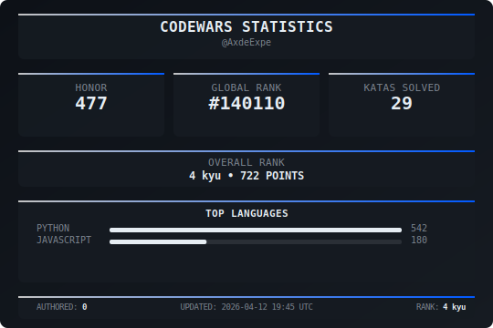
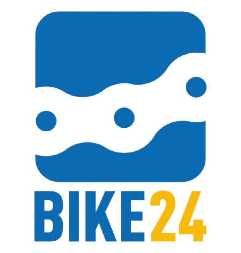

## 🏆 Codewars Stats  

  

## 🛠️ Languages & Tools  

## 🌱 Learning  

**Currently learning: Advanced Python**  

---

## 💼 Experience  

  
###  BIKE24 — Working Student Data Analytics  
📍 Germany · Hybrid  
📅 May 2025 – Today

I contributed to the development and implementation of a software solution for masking snowflake database instances and tables, seamlessly integrated into a data load synchronization framework.  
In addition, I supported data science tasks with a focus on **PII handling** and **intent analysis**.  
I am currently also actively involved in a mid-sized software project, working on **feature implementation** and **unit tests**.  

###  Fraunhofer IVI — Student Assistant Software Development
📍 Germany · On-site  
📅 Aug. 2023 – Oct. 2023 · 3 Months  

As a student trainee at the Fraunhofer IVI, I developed a **real-time monitoring system** on a Raspberry Pi to visualize critical system data from multiple autonomous vehicles and hardware components.  

- Designed and implemented a **Python-based solution** to read sensor data from the battery management system via **Bluetooth Low Energy (BLE)**.  
- Queried vehicle status information from a **PostgreSQL database**.  
- Consolidated and visualized data in **real time** on an LED display.  

The solution improved **reliability and transparency** of the overall system during operation. 

