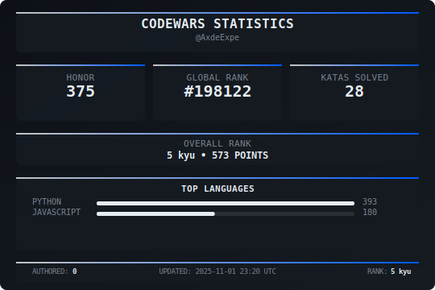

## 🏆 Codewars Stats  

  

## 🛠️ Languages & Tools  

## 🌱 Learning  

**Currently learning: Advanced Python**  

---

## 💼 Experience  

  
###  BIKE24 — Working Student Data Analytics  
📍 Germany · Hybrid  
📅 May 2025 – Today

###  Fraunhofer IVI — Student Assistant Software Development
📍 Germany · On-site  
📅 Aug. 2023 – Oct. 2023 · 3 Months  

